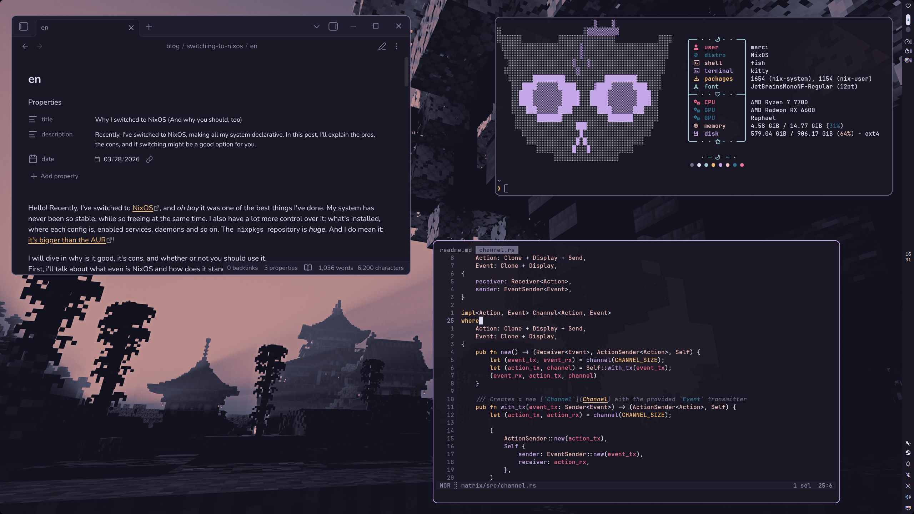

# nixos: már edition 🐱
welcome to my [NixOS](https://nixos.org/) dots! here you'll find both configuration files for my personal computer and my laptop, alongside their
configuration using [home-manager](https://nix-community.github.io/home-manager/).

i made this config aiming to have a simple, minimalist environment that helps me focus while having a pleasant visual that makes everything feels connected.

currently, the only way to run this flake is with the `#laptop` variant. i'm planning on adding a `#desktop` variant soon™, as well as a way to run only the
shared modules (and not the system configuration).

speaking of which, the configuration for each app can be found in the [`modules`](./modules) folder. the modules are split in 4 pieces:
- `home-manager.nix`: shared `home-manager` modules between all variants.
- `nixos.nix`: shared `configuration.nix` modules between all variants.
- `home-manager/`: configuration for each app that is installed and/or configured by the user. if you want to change some setting, it's probably there.
modules should be imported in the `home.nix` file.
- `nixos/`: configuration for system-level apps, such as daemons, services, universal packages, etc. modules should be imported in the `configuration.nix` file.

while i don't make this flake configurable (as you being able to use specific modules, e.g. the `waybar` config), keep in mind that it is
made specifically *for my needs*.

> [!CAUTION]
> **DO NOT** run this flake or you might need to rollback your OS (due to `hardware-configuration.nix`).

however, feel free to copy or use any of my modules for your own configs.

## screenshots

