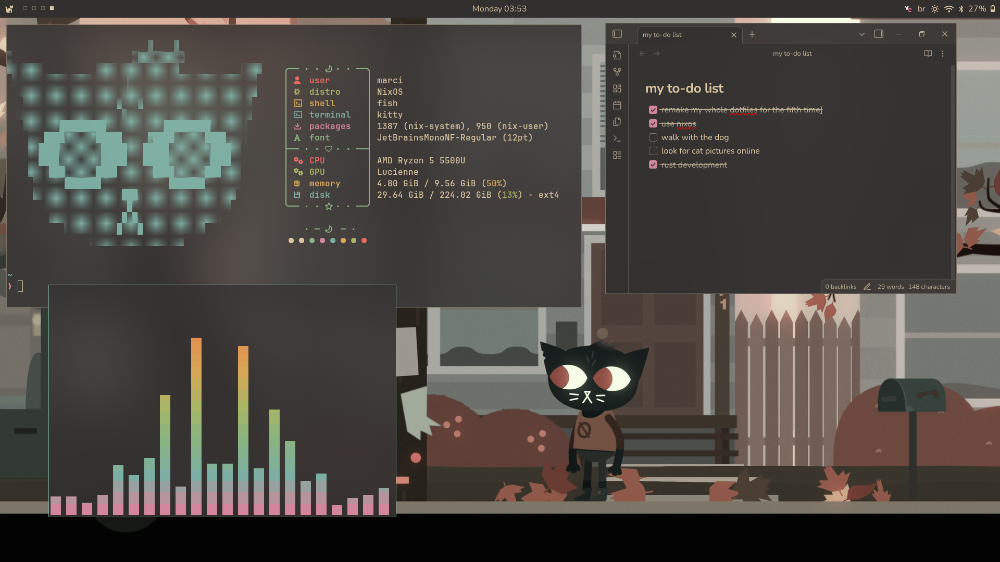

# nixos: már edition 🐱

---

welcome to my [nixos](https://nixos.org/) dots! here you'll find both
configuration files for my personal computer and my laptop, alongside their
configuration using
[home-manager](https://nix-community.github.io/home-manager/), applying the
[dendritic pattern](https://github.com/mightyiam/dendritic) using
[den](https://den.denful.dev/).

i made this config aiming to have a simple, minimalist environment that helps me
focus while having a pleasant visual that makes everything feels connected.

currently, the only way to run this flake is with either the `#laptop` or the
`#desktop` variant. i'm planning on adding a way to run only the shared modules
(and not the system configuration) soon™.

speaking of which, the configuration can be found in the [`modules`](./modules)
folder. the modules are split into these categories:

- [`shards/`](./modules/aspects): configuration for each app. if you want to
  change some setting, it's probably there.
- [`gems/`](./modules/gems): collection of pre-built configurations.
- [`hosts/`](./modules/hosts/): the configuration for each of my machines and
  other exported namespaces. for my machines, each will contain a `default.nix`
  with all of its own configurations, and a `hardware.nix` that will have the
  contents of the auto-generated `hardware-configuration.nix` file.
- [`schemas/`](./modules/schemas): schemas for custom configuration and/or
  metadata a namespace can provide.
- [`users/`](./modules/users): the users of any system.

you can also find pre-defined configurations set for every host and user in
[`defaults.nix`](./modules/defaults.nix).

since this configuration follows the denditric pattern, it is built using
_shards_, like lego blocks. every file in the `shards/` folder contain a
`shards.<shard_name>` definition, that will then be imported by a host or an
user (that are are aspects as well). a shard can be named whatever and the file
be placed wherever within the `modules/` folder, what truly matters is the shard
name defined in the file. i chose to keep the name of the aspect the same of the
file, and nested shards into folders (such as `shards.apps.*`) to ease
navigation.

while i don't make this flake configurable (as you being able to use specific
modules, e.g. the `niri` config), keep in mind that it is made specifically _for
my needs_.

> [!CAUTION]
> **DO NOT** run this flake or you might need to rollback your OS (due to
> `hardware-configuration.nix`).

however, feel free to copy or use any of my modules for your own configs.
